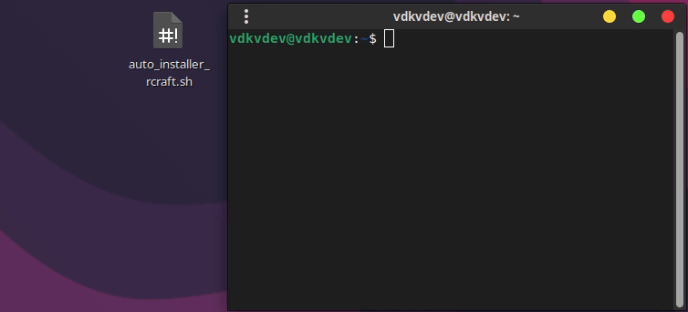

# RCraft - Minecraft CLI Launcher

🦀 An ultra-lightweight Minecraft launcher in CLI, written in Rust, which automatically downloads the necessary files and runs the game.


**Requirements**:
- Rust (latest stable version recommended).
- Internet connection for downloading Minecraft files.
- Java Runtime Environment (JRE) installed on the system (automatically detected).

## Usage
> [!warning]
> RCraft is currently in beta v0.5, so you may encounter bugs.

**Recommendation:** Before executing the binary, it's recommended to run `sudo chmod 777 RCraft` to ensure proper permissions.

Run the binary:
```bash
./RCraft
```
## Demo


## Installation (for dev)
1. **Clone the Repository**:
   ```
   git clone https://github.com/vdkvdev/RCraft.git
   cd RCraft
   ```

2. **Build with Cargo**:
   ```
   cargo build --release
   ```
   - The binary will be at `./target/release/RCraft`.

## License

This project is licensed under the GNU General Public License v3.0 (GPL-3.0).
For more details, see the [LICENSE](LICENSE) file in the repository.
