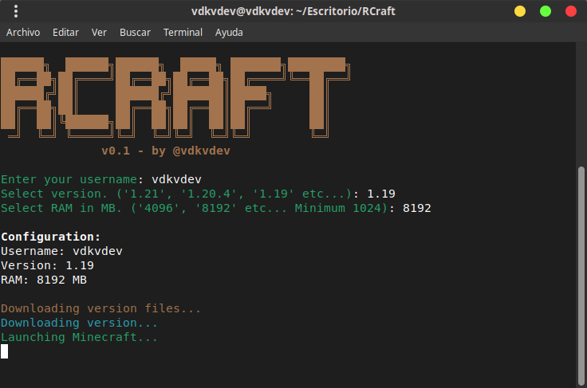

# RCraft - Minecraft CLI Launcher

🦀 An ultra-lightweight Minecraft launcher in CLI, written in Rust, which automatically downloads the necessary files and runs the game.

## Screenshot

<div align="center">
  
</div>

## Feature

- Seamless downloading of Minecraft assets, libraries, and natives.

## Requirements

- Rust (latest stable version recommended).
- Internet connection for downloading Minecraft files.
- Java Runtime Environment (JRE) installed on the system (automatically detected).

## Installation

1. Clone or download the project to your local machine.
2. Navigate to the project directory:
   ```bash
   cd RCraft
   ```
3. Install dependencies:
   ```bash
   cargo build --release
   ```
   This compiles the project with all Rust dependencies (e.g., clap, dialoguer, console, tokio, etc.).

## Usage

Run the launcher:
```bash
cargo run
```

### Steps in Interactive Mode

1. Prompts for username (validated for minimum length).
2. Prompts for Minecraft version (validated against Mojang's version list).
3. Prompts for RAM allocation (validated for minimum 1024 MB).
4. Downloads necessary files if not present (shows progress).
5. Launches Minecraft with the specified settings.

## Technologies Used

- **Rust**: Core language.
- **clap**: For command-line argument parsing.
- **dialoguer**: For interactive user inputs with validation.
- **console**: For terminal styling (colors, ASCII art).
- **tokio**: For asynchronous operations.
- **reqwest**: For HTTP requests to download files.
- **zip**: For extracting downloaded assets.
- **indicatif**: For progress bars during downloads.

## Notes

- The launcher detects Java automatically. Ensure Java is installed and in your PATH.
- Downloads are stored in a local `.minecraft` directory structure for persistence.
- Tested on Unix-like systems (Linux, macOS). Windows may require adjustments for terminal commands.

## License

This project is licensed under the GNU General Public License v3.0 (GPL-3.0).
For more details, see the [LICENSE](LICENSE) file in the repository.
