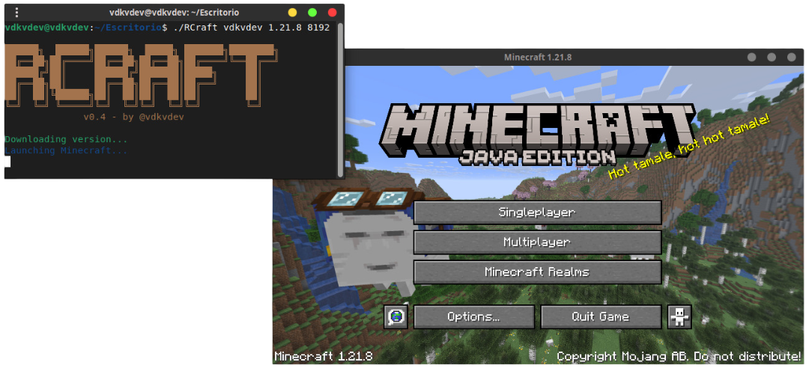

# RCraft - Minecraft CLI Launcher

🦀 An ultra-lightweight Minecraft launcher in CLI, written in Rust, which automatically downloads the necessary files and runs the game.

## Demo
<div align="center">
  
</div>

## Requirements

- Rust (latest stable version recommended).
- Internet connection for downloading Minecraft files.
- Java Runtime Environment (JRE) installed on the system (automatically detected).

## Usage

> [!warning]
> <b>RCraft is currently in beta v0.3, so you may encounter bugs. be gentle with it.</b>

Run the launcher with positional arguments:
```bash
./RCraft <username> <minecraft_version>
```

**Recommendation:** Before executing the binary, it's recommended to run `sudo chmod 777 RCraft` to ensure proper permissions.

Example:
```bash
./RCraft vdkvdev 1.13
```

## Notes

- The launcher detects Java automatically. Ensure Java is installed and in your PATH.
- Downloads are stored in a local `.minecraft` directory structure for persistence.
- Tested on Unix-like systems (Linux, macOS). Windows may require adjustments for terminal commands.

## Upcoming Features

- Support for Minecraft versions below 1.13.

## License

This project is licensed under the GNU General Public License v3.0 (GPL-3.0).
For more details, see the [LICENSE](LICENSE) file in the repository.
