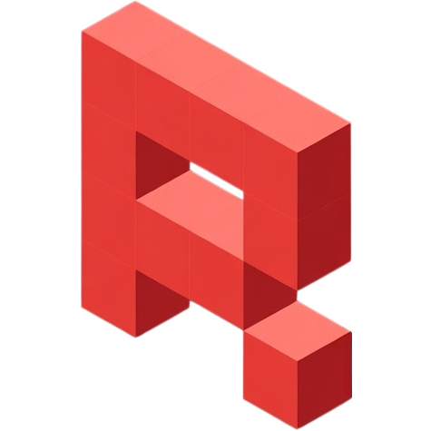
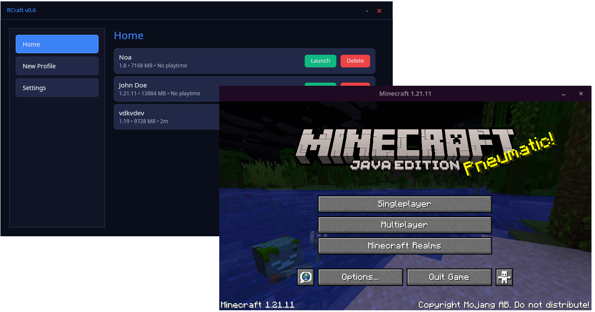
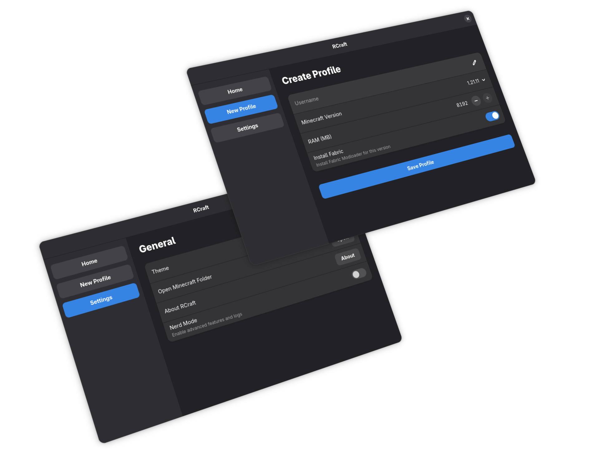

<div align="center">



# RCraft

**A Modern, Lightweight Minecraft Launcher for Linux**

[](https://www.rust-lang.org/)
[](https://www.gtk.org/)
[](LICENSE)
[]()

</div>

---

**RCraft** is a high-performance, open-source Minecraft launcher built with **Rust** and the **GTK4** framework (via Relm4). Designed for Linux, it offers a seamless, beautiful, and native experience for managing your Minecraft adventures.

With a focus on speed, aesthetics, and usability, RCraft integrates perfectly with modern Linux desktop environments thanks to **Libadwaita**.

<div align="center">
  
</div>

## ✨ Features

- **🚀 Modern Native UI**: Built with GTK4 and Libadwaita for a sleek, responsive, and native Linux feel.
- **📦 Smart Version Management**: Easily download and launch any Minecraft version.
- **🔧 Profile System**: Create and manage multiple isolated game profiles with custom settings.
- **⚡ Performance First**: Lightweight footprint and fast startup times powered by Rust.
- **🧶 Modding Ready**: Support for modded environments (Fabric) and custom game directories.
- **☕ Auto-Java Detection**: Automatically finds and selects the appropriate Java Runtime Environment for your game version.
- **💾 Resource Management**: Customize RAM allocation per profile to ensure smooth gameplay.

## 🚀 Usage

RCraft is distributed as an **AppImage**, a universal package that runs on almost any Linux distribution without needing installation.

### Quick Start

1. **Download** the latest `RCraft-x86_64.AppImage` from the [Releases](https://github.com/vdkvdev/RCraft/releases) page.
2. **Make it executable**:
   Open your terminal and run:
   ```bash
   chmod +x RCraft-x86_64.AppImage
   ```
3. **Run**:
   ```bash
   ./RCraft-x86_64.AppImage
   ```
   *Or simply double-click the file.*

<div align="center">
  
</div>

## 🔮 To Do

- [ ] Support for Windows
- [ ] Manual Java Version Selection

## 📄 License

Distributed under the **GPL-3.0 License**. See [LICENSE](LICENSE) for more information.

---

<div align="center">
  Created in 🇨🇱 by <a href="https://github.com/vdkvdev">vdkvdev</a>
</div>
