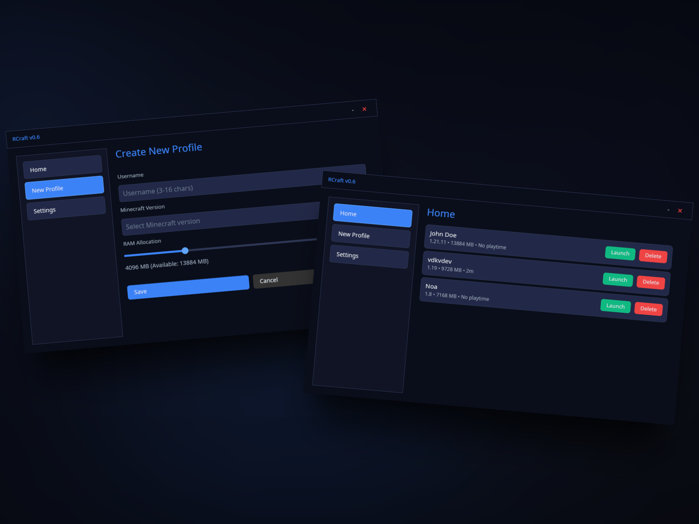

# RCraft - Minecraft Launcher

🦀 A modern, lightweight Minecraft launcher built with Rust and powered by the Iced GUI framework.


RCraft provides a sleek, user-friendly interface for managing Minecraft profiles, versions, and game launches with automatic file downloads and Java detection.

## Features

✨ **Modern GUI Interface** - Clean and intuitive Dracula-themed interface  
📦 **Automatic Downloads** - Automatically downloads required Minecraft files  
⚡ **Profile Management** - Create and manage multiple game profiles  
🎮 **Version Selection** - Choose from all Minecraft versions
💾 **RAM Allocation** - Customize memory allocation per profile  
☕ **Java Auto-Detection** - Automatically finds your Java installation  




## Requirements

- **Operating System**: Linux
- **Internet Connection**: Required for downloading Minecraft files
- **Java Runtime Environment (JRE)**: Java 8 or higher (automatically detected)

## Installation

### Download

Download the latest `RCraft` binary from the [releases](https://github.com/vdkvdev/RCraft/releases) page.

### Setup

1. Give execution permissions:
   ```bash
   chmod +x RCraft
   ```

## Technical Details

**Built with**:
- **Rust** - High-performance systems programming language
- **Iced** - Cross-platform GUI framework
- **Tokio** - Asynchronous runtime
- **Serde** - Serialization framework

**Data Storage**:
- Profiles: `~/.minecraft/profiles.json`
- Language: `~/.minecraft/language.json`
- Game Files: `~/.minecraft/`

## Development Status

> [!WARNING]
> RCraft is currently in **beta v0.5**. While functional, you may encounter bugs or missing features.

## License

This project is licensed under the **GNU General Public License v3.0 (GPL-3.0)**.

For more details, see the [LICENSE](LICENSE) file in the repository.