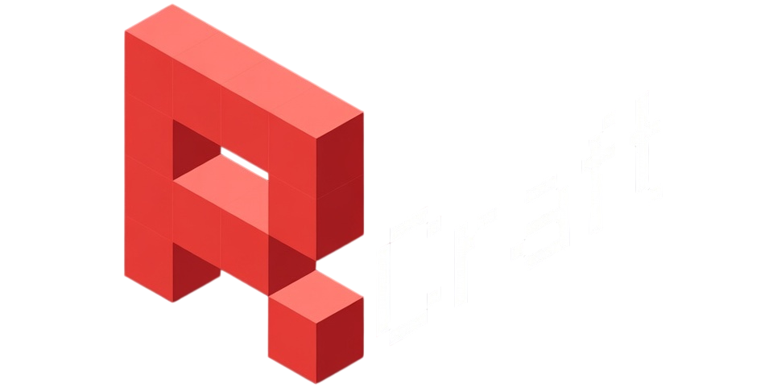

# RCraft - Minecraft Launcher

🦀 A modern, lightweight Minecraft launcher built with Rust and powered by the Iced GUI framework.

<p align="center">
  
</p>

RCraft provides a sleek, user-friendly interface for managing Minecraft profiles, versions, and game launches with automatic file downloads and Java detection.

## Features

✨ **Modern GUI Interface** - Clean and intuitive Dracula-themed interface  
📦 **Automatic Downloads** - Automatically downloads required Minecraft files  
⚡ **Profile Management** - Create and manage multiple game profiles  
🎮 **Version Selection** - Choose from all Minecraft versions
💾 **RAM Allocation** - Customize memory allocation per profile  
☕ **Java Auto-Detection** - Automatically finds your Java installation  


## Requirements

- **Operating System**: Linux
- **Internet Connection**: Required for downloading Minecraft files
- **Java Runtime Environment (JRE)**: Java 8 or higher (automatically detected)

## Installation

### Download

RCraft is available in multiple formats for Linux systems. Choose the one that works best for your distribution:

- **AppImage** (`rcraft-v0.6-x86_64.AppImage`) - Universal Linux package, works on most distributions
- **Debian** (`rcraft-v0.6-amd64.deb`) - For Debian-based systems
- **Fedora** (`rcraft-v0.6.x86_64.rpm`) - For RPM-based systems
- **Standalone Binary** (`rcraft-v0.6-x86_64`) - Universal executable

Download your preferred format from the [releases](https://github.com/vdkvdev/RCraft/releases) page.

### Setup

#### AppImage
```bash
chmod +x rcraft-v0.6-x86_64.AppImage
./rcraft-v0.6-x86_64.AppImage
```

#### Debian (.deb)
```bash
sudo dpkg -i rcraft-v0.6-amd64.deb
# Or double-click the .deb file in your file manager
```

#### Fedora (.rpm)
```bash
sudo rpm -i rcraft-v0.6.x86_64.rpm
# Or use: sudo dnf install rcraft-v0.6.x86_64.rpm
```

#### Standalone Binary
```bash
chmod +x rcraft-v0.6-x86_64
./rcraft-v0.6-x86_64
```


## Technical Details

**Data Storage**:
- Profiles: `~/.minecraft/profiles.json`
- Language: `~/.minecraft/language.json`
- Game Files: `~/.minecraft/`

## Development Status

> [!WARNING]
> RCraft is currently in **beta**. While functional, you may encounter bugs or missing features.

## License

This project is licensed under the **GNU General Public License v3.0 (GPL-3.0)**.

For more details, see the [LICENSE](LICENSE) file in the repository.
