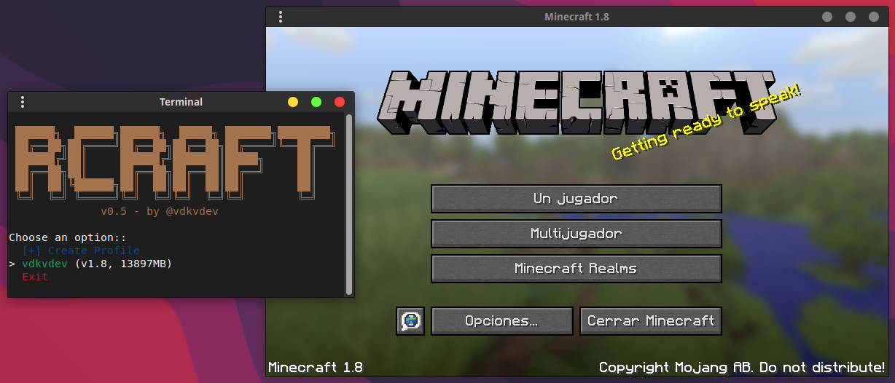

🦀 RCraft - Minecraft CLI Launcher

RCraft is a lightweight, command-line Minecraft launcher written in Rust. It supports downloading and launching Minecraft versions, with interactive profile management for easy setup and gameplay. No GUI, just a fast, terminal-based experience intuitive menus.

<div align="center">
  
</div>

> [!Note]
> Currently, RCraft v0.5 (beta) supports Linux only

**Requirements**:
- Rust (latest stable version recommended).
- Internet connection for downloading Minecraft files.
- Java Runtime Environment (JRE) installed on the system (automatically detected).

## Usage
> [!warning]
> RCraft is currently in beta v0.5, so you may encounter bugs.

**Recommendation:** Before executing the binary, it's recommended to run `sudo chmod 777 RCraft` to ensure proper permissions.

Run the binary:
```bash
./RCraft
```
## Demo
<p align="center">
  <video autoplay loop muted playsinline>
    <source src="media/video.mp4" type="video/mp4">
  </video>
</p>

## Installation (for dev)
1. **Clone the Repository**:
   ```
   git clone https://github.com/vdkvdev/RCraft.git
   cd RCraft
   ```

2. **Build with Cargo**:
   ```
   cargo build --release
   ```
   - The binary will be at `./target/release/RCraft`.

## Features
- **Interactive CLI**: No command-line arguments needed. Run and interact via menus to create profiles, launch games, or manage setups.
- **Profile Management**: Create profiles with username, version, and RAM allocation. Profiles are saved in `~/.minecraft/profiles.json` for persistence.
- **Version Support**: Downloads official Minecraft versions.
- **Async Downloads**: Uses Reqwest and Tokio for efficient, non-blocking downloads of JARs, libraries, assets, and natives.
- **Java Auto-Detection**: Finds and uses the system Java installation (supports multiple versions).
- **RAM Management**: Allocates specified RAM, capped to system available memory to prevent crashes.
- **Lightweight**: Minimal dependencies. Built for speed and low resource usage.
- **Extraction & Classpath**: Handles ZIP natives extraction and builds the full classpath for launch.

## License

This project is licensed under the GNU General Public License v3.0 (GPL-3.0).
For more details, see the [LICENSE](LICENSE) file in the repository.
